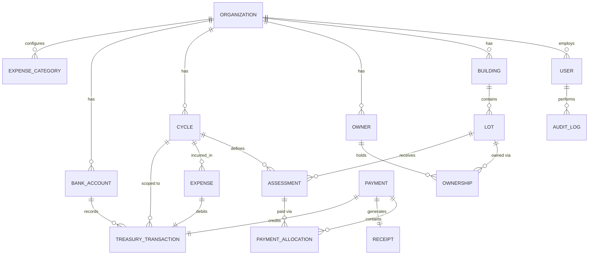

# 02 — Domain Model

## Aggregate overview

## Entities

### Organization
The tenant boundary. A residence/syndic. Every other collection (except
`AuditLog`, which is tenant-scoped too) carries an `organizationId`.

### User / Role
Authenticated actor. Belongs to exactly one Organization (V1 — a user does not
span organizations; a super-admin is a distinct global role, see
[07-auth-security.md](07-auth-security.md)).

### Building
A physical block inside an Organization (`Bloc A`, `RDC`, etc.). Free-form name,
not an enum.

### Lot
A billable unit inside a Building. Carries surface (for SURFACE_BASED
assessments), type, status. A Lot with no Building (the "Autre/Intermeuble"
case from the Excel data) is supported via `buildingId: null` + `type:
"COMMON_CHARGE"`.

### Owner / Ownership
Owner is a person or company. Ownership is the join entity between Owner and
Lot, carrying a share percentage and validity window, so a Lot's ownership can
change over time without losing history (see §Ownership changes below).

### Cycle
A syndic-defined billing period with arbitrary start/end dates. Owns the
assessment rate(s) in effect for that period. See
[04-financial-model.md](04-financial-model.md) for full lifecycle rules.

### Assessment
What a Lot owes for a Cycle. Generated when the Cycle is opened (or added
later for a lot added mid-cycle), immutable amount unless explicitly adjusted
via a reversal/adjustment record (never silently edited after payments exist
against it).

### Payment / PaymentAllocation
A Payment is money received. It contains one or more PaymentAllocation entries,
each crediting a specific Assessment (and therefore a specific Lot) for a
specific amount. Sum of allocations == payment amount, enforced at write time.

### Receipt
Generated 1:1 from a completed Payment, carries an atomically-assigned
sequential number.

### Expense
Money spent, scoped to a Cycle (derived from its date, but the Cycle
association is stored, not recomputed, so historical reports stay stable even
if cycle boundaries are edited before being opened — see ADR-005).

### BankAccount / TreasuryTransaction
Every movement of money is a TreasuryTransaction referencing a BankAccount.
Payments and Expenses each produce exactly one TreasuryTransaction. Manual
`ADJUSTMENT` and inter-account `TRANSFER` transactions are also supported.

### AuditLog
Append-only record of sensitive mutations across the system.

## Ownership changes over time

An Ownership row has `startDate` and `endDate` (nullable = current). When a
lot is sold, the old Ownership row is closed (`endDate` set) and a new one is
created — history is preserved, and Assessments already issued keep pointing
at the Lot (not the Owner), so past financial records remain accurate
regardless of who owns the lot today. "Who currently owes this balance" is
resolved at read time via the active Ownership as of the Assessment's cycle
dates — this is documented as **BUSINESS DECISION REQUIRED**: does a new owner
inherit the previous owner's unpaid balance, or does the debt stay attached to
the previous owner personally? See
[04-financial-model.md](04-financial-model.md) §Open Business Decisions.

## Why references, not one giant embedded tree

MongoDB favors embedding data that is always read together and bounded in
size. Here:

- **Embedded**: `PaymentAllocation[]` inside `Payment` (always created and read
  together, bounded to a handful of lots per payment, never queried
  independently of its parent payment).
- **Referenced**: everything else. Lots, Owners, Cycles, Assessments, Expenses,
  TreasuryTransactions are independently queried, paginated, filtered, and
  grow unboundedly over the organization's lifetime — embedding them anywhere
  would blow past MongoDB's 16MB document limit and make indexing/pagination
  impossible.

Full field-by-field schemas and index design are in
[03-mongodb-architecture.md](03-mongodb-architecture.md).
